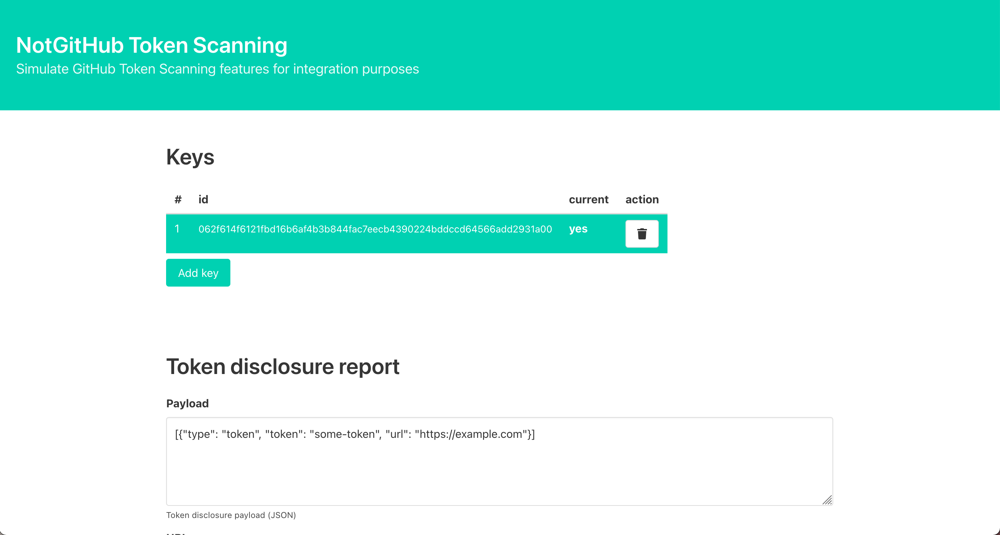

# NotGitHub Token Scanning

This project defines a simple Python service that replaces "GitHub" when integrating
the [Secrets Scanning](https://docs.github.com/en/developers/overview/secret-scanning)
feature from GitHub



## How to

### Run using docker
Docker without compose:
```console
$ docker run \
    --rm -p 8000:8000 -e "NOTGITHUB_DEFAULT_URL=http://other/_/github/disclose" \
    ewjoachim/notgithub-token-scanning
```

Docker compose:
```yml
notgithub:
  image: ewjoachim/notgithub-token-scanning
  environment:
    NOTGITHUB_DEFAULT_URL: "http://your-service/your/disclose/url"
```

### Build & run without docker

In a virtual environment, run `scripts/build` and `scripts/serve`

### Use

Visit `/` on port `8000`. Add/remove/reorder keys, select the "current" key.
This will impact both the keys exposed at `/meta/public_keys/token_scanning` and
the current key will be the one used for signing the payload.

Enter your payload and the URL to call. Default url can be configured with the
`NOTGITHUB_DEFAULT_URL` environment variable.

