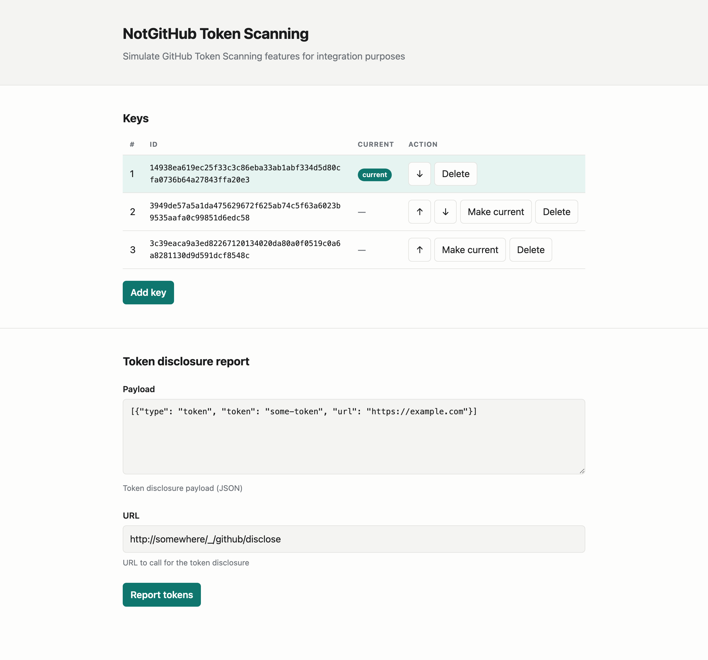
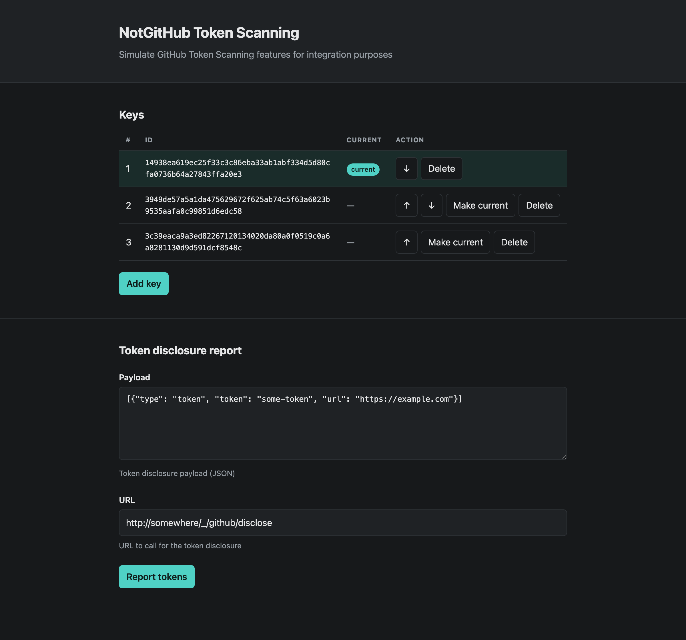

# NotGitHub Token Scanning

Disclaimer: I'm not affiliated with GitHub in any way.

This project defines a simple Python service that replaces GitHub when integrating
the [Secrets Scanning](https://docs.github.com/en/developers/overview/secret-scanning)
feature from GitHub from the point of view of the integrating app: it does no scanning
at all but it lets you simulate realistic payloads that GitHub would be sending to
your service if it found some tokens.


The interface follows your system's light or dark preference:

| Light | Dark |
| --- | --- |
|  |  |

## How to

### Run using docker

`latest` docker label follows the `main` branch, we frequently rebuild to get the latest versions of dependencies. To pin a digest, find the
current digest value on the
[image's tag list](https://github.com/ewjoachim/notgithub-token-scanning/pkgs/container/notgithub-token-scanning).

Docker without compose:
```console
$ docker run \
    --rm -p 8000:8000 -e "NOTGITHUB_DEFAULT_URL=http://other/_/github/disclose" \
    ghcr.io/ewjoachim/notgithub-token-scanning:latest@sha256:<digest>
```

Docker compose:
```yml
notgithub:
  image: ghcr.io/ewjoachim/notgithub-token-scanning:latest@sha256:<digest>
  environment:
    NOTGITHUB_DEFAULT_URL: "http://your-service/your/disclose/url"
```

Tagged releases (`v1`, `v2`, ...) are published as image tags of the same name,
if you'd rather pin a fixed version (you won't get updated dependencies though)

The same image is also pushed to Docker Hub as
`ewjoachim/notgithub-token-scanning`
([tag list](https://hub.docker.com/r/ewjoachim/notgithub-token-scanning/tags)),
if you'd rather pull from there.

### Build & run without docker

With [uv](https://docs.astral.sh/uv/) installed:

```console
$ uv run uvicorn main:app
```

`uv` creates the virtual environment, fetches Python 3.14 and installs the
dependencies on its own.

### Use

Visit `/` on port `8000`. Add/remove/reorder keys, select the "current" key.
This will impact both the keys exposed at `/meta/public_keys/token_scanning` and
the current key will be the one used for signing the payload.

Enter your payload and the URL to call. Default url can be configured with the
`NOTGITHUB_DEFAULT_URL` environment variable.
